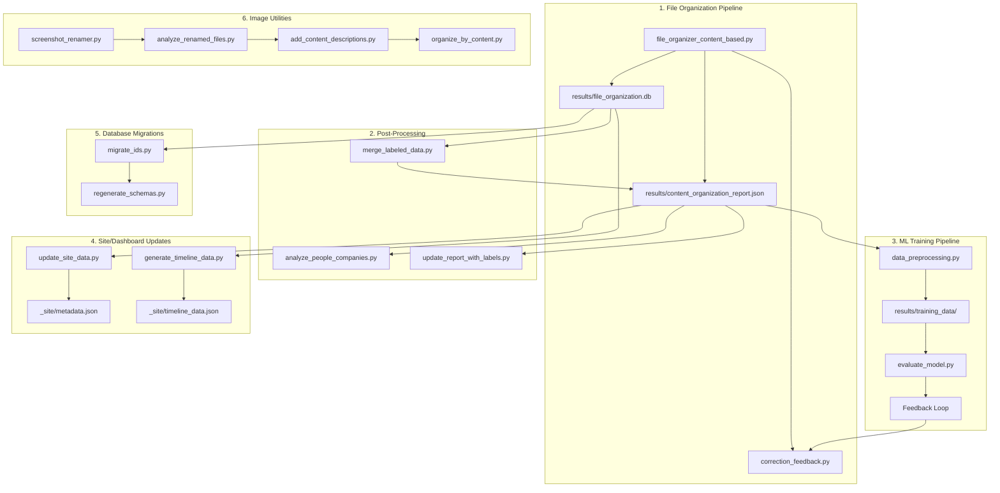

# Schema.org File Organization System

AI-powered file organization using CLIP vision, OCR, Schema.org metadata, and entity detection.

## Quick Start

```bash
source venv/bin/activate

# With Sentry error tracking (recommended)
./scripts/run_with_sentry.sh --dry-run --limit 100 --sources ~/Downloads

# Direct usage
python3 scripts/file_organizer_content_based.py --base-path ~/Documents --sources ~/Documents/Media --limit 1000

# Check dependencies
python3 scripts/file_organizer_content_based.py --check-deps
```

## Status

| Metric | Value |
|--------|-------|
| Files processed | 72,978+ |
| Success rate | 98.6% |
| Top category | GameAssets (84.8%) |
| Database | `results/file_organization.db` |

## Key Features

- **Entity Detection**: Prioritizes Organization and Person identification
- **Entity-based Folders**: Creates `Organization/{EntityName}/` and `Person/{PersonName}/` subfolders
- **Canonical IDs**: UUID v5 + SHA256 for persistent entity identification
- **Game Asset Detection**: 200+ patterns including numbered sprites (42_8.png)
- **Schema.org Metadata**: Full JSON-LD generation with @id fields

## Output Folder Structure

```
~/Documents/
├── Organization/
│   ├── {CompanyName}/          # Vendor/partner files
│   └── Clients/{ClientName}/   # Client-specific files
├── Person/
│   └── {PersonName}/           # Person-related files
├── GameAssets/                 # Game sprites, textures, models
├── Financial/                  # Invoices, receipts, taxes
├── Technical/                  # Code, configs, documentation
└── Media/                      # Photos, videos, audio
```

## Project Structure

```
├── scripts/
│   ├── file_organizer_content_based.py  # Main AI organizer
│   ├── run_with_sentry.sh               # Run with error tracking
│   ├── data_preprocessing.py            # ML training data prep
│   ├── correction_feedback.py           # User correction system
│   ├── evaluate_model.py                # Model evaluation
│   └── ...                              # Other utility scripts
├── src/
│   ├── health_check.py              # Dependency validation
│   ├── error_tracking.py            # Sentry integration
│   ├── cost_roi_calculator.py       # Cost tracking
│   ├── generators.py                # Schema.org metadata generation
│   └── storage/
│       ├── graph_store.py           # SQLAlchemy graph with canonical IDs
│       └── migration.py             # Database migration scripts
├── _site/                           # Dashboard UI
├── results/                         # Reports & database
└── docs/DEPENDENCIES.md             # Install guide
```

## Configuration

### Doppler Secrets

| Project | Key | Description |
|---------|-----|-------------|
| `integrity-studio` | `FILE_SYSTEM_SENTRY_DSN` | Sentry error tracking DSN |

### Environment Variables

| Variable | Priority | Description |
|----------|----------|-------------|
| `--sentry-dsn` | 1 | CLI argument |
| `FILE_SYSTEM_SENTRY_DSN` | 2 | Doppler/env |
| `SENTRY_DSN` | 3 | Fallback |

## Dependencies

```bash
pip install -r requirements.txt && brew install tesseract poppler
```

**Core:** Pillow, pillow-heif, pytesseract, geopy, SQLAlchemy, sentry-sdk
**AI/ML:** torch, transformers, opencv-python

## Troubleshooting

| Issue | Solution |
|-------|----------|
| Check deps | `--check-deps` |
| HEIC fails | `pip install pillow-heif` |
| No OCR | `brew install tesseract` |
| No AI | `pip install torch transformers` |
| No Sentry | Check `FILE_SYSTEM_SENTRY_DSN` in Doppler |

## Classification Priority

The organizer uses this detection order:

1. **Organization Detection** - Keywords: client, vendor, invoice, company names
2. **Person Detection** - Keywords: resume, contact, signatures, person names
3. **Game Asset Detection** - 200+ patterns, sprites, textures, models
4. **Filepath Matching** - Directory structure patterns
5. **Content Analysis** - OCR text and CLIP vision
6. **MIME Type** - File extension fallback

## Script Dependency Graph



### Script Execution Order

| Phase | Script | Purpose |
|-------|--------|---------|
| **1. Organize** | `file_organizer_content_based.py` | Main AI-powered organization |
| **2. Analyze** | `analyze_people_companies.py` | Extract entity summaries |
| **3. Label** | `correction_feedback.py` | Record user corrections |
| **4. Merge** | `merge_labeled_data.py` | Combine labels into report |
| **5. Train** | `data_preprocessing.py` | Prepare ML training data |
| **6. Evaluate** | `evaluate_model.py` | Test model performance |
| **7. Migrate** | `migrate_ids.py` | Update database schema |
| **8. Regenerate** | `regenerate_schemas.py` | Rebuild Schema.org metadata |
| **9. Publish** | `update_site_data.py` | Update dashboard files |

### Standalone Utilities

| Script | Purpose |
|--------|---------|
| `file_organizer_by_name.py` | Simple name-based organization (no AI) |
| `file_organizer_by_type.py` | Extension-based organization (no AI) |
| `image_renamer_metadata.py` | Rename images using EXIF/OCR |
| `screenshot_renamer.py` | Categorize and rename screenshots |
| `organize_to_existing.py` | Move files to existing folder structure |

---
**Python:** 3.14 | **Version:** 1.3.0 | **Updated:** 2025-12-10
