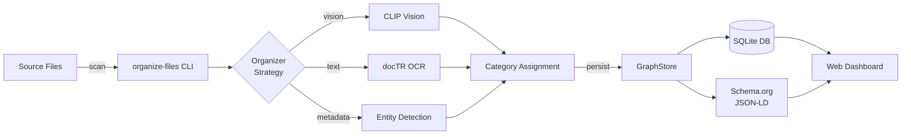

# Schema.org File Organization System

AI-powered file organization using CLIP vision, OCR, Schema.org metadata, and entity detection.

**Version:** 2.1.0 | **Python:** 3.14+ (use a pyenv-built interpreter on macOS 26) | **Files Processed:** 265,000+

## Capabilities

Scans directories, classifies files by content, organizes them into a semantic folder hierarchy, and builds a Schema.org-typed knowledge graph that is queryable over REST.

- **Content classification** — unified weighted-signal scorer: 19 signals (entity detection, legal, financial, research publishers, game assets, filepath, screenshot OCR, CLIP vision, scene probe, media heuristics, MIME fallback) run in cost-tier waves with early exit; the highest aggregated `(category, subcategory)` wins, and margin/confidence thresholds route weak decisions to `uncategorized`. The legacy first-match-wins tier chain was removed in Phase 5 (see [FILE_ORGANIZATION.md](docs/FILE_ORGANIZATION.md) and [UNIFIED_SCORING_PLAN.md](docs/architecture/UNIFIED_SCORING_PLAN.md)).
- **CLIP + OCR vision** — unified `classify_with_ocr_fallback()` (CLIP ViT-B-32 + cached embeddings) with OCR fallback for low-confidence predictions.
- **Image/screenshot renaming** — `rename_images.py --profile {photo,screenshot}` selects vocabulary and in-place vs. folder mode; the screenshot profile prefers a title-like OCR line (`Screenshot_<title>`) over the generic CLIP label when one qualifies.
- **Schema.org graph store** — SQLAlchemy ORM with canonical IDs (UUID v5 + SHA-256); every entity exposes `to_schema_org()`, plus bulk JSON/NDJSON/`@graph` export and JSON-LD `@context` generation.
- **Near-duplicate detection** — `find-duplicates` reports the same content in different bytes (re-encoded, resized, cropped, PDF-vs-image), which exact content-hash grouping cannot see. SSCD copy-detection descriptors indexed with faiss; read-only, and it never moves or deletes anything.
- **ML support** — training-data preprocessing, model evaluation, and a scoring-calibration harness (`make calibrate`, plus `make weight-search` for a nevergrad joint weight/threshold search).
- **Dashboard + timeline** — static UI in `_site/`, fed by `update-site` and `timeline` data generators.

All entry points share one backing SQLite graph (`results/file_organization.db`): the CLI writes classifications, the API serves them as JSON-LD, and the dashboard visualizes them.

## Entry Points

| Surface | How to launch |
|---------|---------------|
| **CLI** | `organize-files <command>` (console script → `src.cli:main`) — command reference in [QUICK_START.md](QUICK_START.md) |
| **REST API** | `uvicorn src.api.schema_org_api:app --reload` — JSON-LD endpoints (see [SCHEMA_ORG_ARCHITECTURE.md](docs/SCHEMA_ORG_ARCHITECTURE.md) and [ARCHITECTURE.md#rest-api-srcapischema_org_apipy](docs/ARCHITECTURE.md#rest-api-srcapischema_org_apipy)) |
| **Library** | Import organizers/classifiers from `src.organizers` / `src.classifiers` and the graph store from `src.storage`; `scripts/` entry points are thin CLI wrappers (run from project root so `from shared.x import y` resolves) |
| **Dashboard** | Static UI in `_site/`, consuming data from `update-site` / `timeline` |

## Quick Start

```bash
git clone https://github.com/aledlie/schema-org-file-system.git
cd schema-org-file-system
python3.14 -m venv venv && source venv/bin/activate
pip install -e ".[all]"
brew install tesseract poppler

organize-files content --source ~/Downloads --dry-run --limit 100
organize-files health  # Should report 12/12 features operational
```

Full setup, daily-use commands, output-folder layout, ML workflow, and dev checks are in **[QUICK_START.md](QUICK_START.md)**.

> **macOS 26 note:** Homebrew's `python@3.13`/`@3.14` bottles link `pyexpat` against a newer `libexpat` than macOS 26 ships, breaking `pip` on fresh installs. If you see `Symbol not found: _XML_SetAllocTrackerActivationThreshold`, see the Troubleshooting table in [CLAUDE.md](CLAUDE.md#troubleshooting).

## Architecture



- **Module map, data flow, IRI strategy, MIME→type mapping, REST layer** — [docs/ARCHITECTURE.md](docs/ARCHITECTURE.md)
- **Detailed diagrams** (system overview, database schema, module dependencies) — [docs/ARCHITECTURE.md#diagrams](docs/ARCHITECTURE.md#diagrams)
- **Pipeline internals, classification priority, renamer profiles/modes, persistence** — [docs/FILE_ORGANIZATION.md](docs/FILE_ORGANIZATION.md)
- **Schema.org type mappings, entity details, relationships, JSON-LD `@context`** — [docs/SCHEMA_ORG_ARCHITECTURE.md](docs/SCHEMA_ORG_ARCHITECTURE.md)

## Tech Stack

| Layer | Technology |
|-------|------------|
| AI/ML | PyTorch, open-clip-torch, OpenCV, scikit-learn |
| OCR | docTR (PyTorch); easyocr preferred for the screenshot path when installed |
| Similarity | faiss (near-duplicate index) + SSCD copy-detection descriptors |
| Calibration | nevergrad (derivative-free weight/threshold search) |
| Database | SQLite + SQLAlchemy |
| API | FastAPI |
| Monitoring | Sentry SDK |
| Testing | pytest, pytest-benchmark, Playwright |

## Documentation

- [QUICK_START.md](QUICK_START.md) — setup, daily-use commands, output folders, ML workflow, dev checks
- [docs/ARCHITECTURE.md](docs/ARCHITECTURE.md) — module map, data flow, serialization layer, REST API, diagrams
- [docs/FILE_ORGANIZATION.md](docs/FILE_ORGANIZATION.md) — content pipeline, classification priority, renamer profiles, persistence
- [docs/SCHEMA_ORG_ARCHITECTURE.md](docs/SCHEMA_ORG_ARCHITECTURE.md) — Schema.org type mappings, IRI patterns, JSON-LD context, builder pattern
- [CLAUDE.md](CLAUDE.md) — CLI reference, environment variables, troubleshooting, gotchas
- [docs/BACKLOG.md](docs/BACKLOG.md) — open follow-up work
- Changelogs: [v2.1.0](docs/changelog/2.1.0/CHANGELOG.md) · [v2.0.0](docs/changelog/2.0.0/CHANGELOG.md) · [v1](docs/changelog/v1/CHANGELOG.md)

## Changelog

Current release is **v2.1.0** (2026-06-29) plus unreleased Person-taxonomy Option C, thin-wrapper refactor, streaming Schema.org export, and analyzer/renaming improvements. See [docs/changelog/2.1.0/CHANGELOG.md](docs/changelog/2.1.0/CHANGELOG.md) for detail and older changelogs above.
