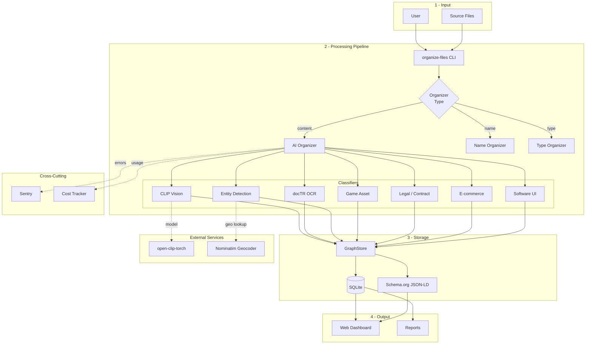
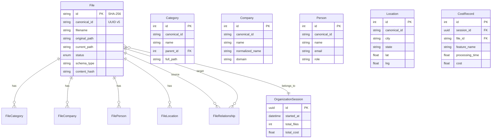
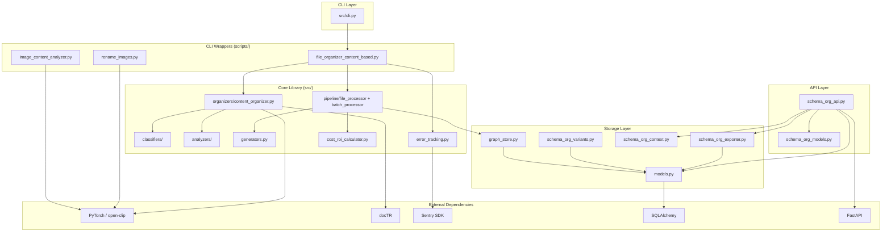

# Architecture

Current-state reference for the schema-org-file-system. As of 2026-07-15.

---

## Module Map

The `scripts/` monolith described in earlier revisions has been decomposed into
modular `src/` packages; the old god-script is now a thin CLI wrapper (see
[Refactoring status](#refactoring-status)).

```
schema-org-file-system/
│
├── src/                              # Core library
│   ├── cli.py                        # Unified CLI entry (organize-files)
│   ├── generators.py                 # Schema.org metadata generation
│   ├── enrichment.py                 # Metadata enrichment
│   ├── validator.py                  # Schema validation
│   ├── error_tracking.py             # Sentry integration
│   ├── health_check.py               # Dependency checks
│   │
│   ├── classifiers/                  # content_classifier, entity_detector (company/person)
│   ├── analyzers/                    # image_analyzer, image_metadata (EXIF/GPS), text_extractor
│   ├── organizers/                   # base_organizer, content_organizer, name_organizer,
│   │                                 #   category_config, mime_classifier
│   ├── pipeline/                     # batch_processor, file_processor
│   ├── ml/                           # data_preprocessor, feature_extractor
│   ├── feedback/                     # correction_tracker, feedback_loop
│   ├── utils/                        # tracking + shared helpers
│   │
│   ├── scoring/                      # Unified weighted-signal classifier (the decision engine)
│   │   ├── scorer.py                 # Cost-tier waves + early exit; aggregates signal votes
│   │   ├── registry.py               # Signal registration/ordering
│   │   ├── weights.py                # Signal priors + decision thresholds (calibrated — see below)
│   │   ├── context.py                # FileContext (lazy OCR/KIE/CLIP accessors)
│   │   ├── types.py                  # CategoryScore, ClassificationDecision
│   │   └── signals/                  # 19 signal modules (org, person, legal, kie, scene, clip, mime, …)
│   │
│   ├── similarity/                   # Near-duplicate detection (read-only report)
│   │   ├── descriptors.py            # SSCD copy-detection descriptors + cache (.cache/sscd_descriptors_v1/)
│   │   ├── index.py                  # faiss IndexFlatIP + union-find grouping
│   │   ├── worker.py                 # Runs the faiss stage in a subprocess (faiss/torch libomp clash)
│   │   ├── finder.py                 # Walk -> describe -> group -> report
│   │   ├── types.py                  # SimilarPair, DuplicateGroup (cross the process boundary)
│   │   └── constants.py              # Model URL, preprocessing, thresholds
│   │
│   ├── storage/                      # Data persistence
│   │   ├── models.py                 # SQLAlchemy ORM + build_*_jsonld builders (serialization SoT)
│   │   ├── graph_store.py            # Graph DB operations (canonical IDs, person edges)
│   │   ├── migration.py              # Canonical-ID migration
│   │   ├── person_migration.py       # Person/ → Personal/{subcat} migration (+ rollback)
│   │   ├── person_view_generator.py  # Derived Person/{Name}/ symlink view
│   │   ├── kv_store.py               # Key-value store
│   │   ├── schema_org_base.py        # SchemaOrgSerializable base (get_iri/get_schema_type/to_schema_org)
│   │   ├── schema_org_exporter.py    # Batch/streaming JSON-LD export (SchemaOrgExporter)
│   │   ├── schema_org_context.py     # Standalone JSON-LD @context generation
│   │   └── schema_org_variants.py    # Alternative representations (Category/Person/File variants)
│   │
│   └── api/                          # REST API (FastAPI)
│       ├── schema_org_api.py         # JSON-LD endpoints (see REST API below)
│       ├── schema_org_models.py      # Pydantic response models
│       └── timeline_api.py           # Timeline endpoints
│
├── scripts/                          # Thin CLI wrappers + operational scripts
│   ├── file_organizer_content_based.py  # Thin wrapper over src/{classifiers,analyzers,organizers,pipeline}
│   ├── rename_images.py                 # Unified CLIP renamer (--profile photo|screenshot)
│   ├── redact_pii.py                    # Rasterize + OCR-redact PII before VCS
│   └── shared/                          # Run from project root so `from shared.x import y` resolves
│       ├── clip_classification.py       # Unified CLIP+OCR pipeline (classify_with_ocr_fallback)
│       ├── clip_utils.py                # CLIPClassifier singleton (open-clip ViT-B-32)
│       ├── clip_cache.py                # Embedding cache (.cache/clip_embeddings_v2/)
│       ├── ocr_classifier.py            # OCR fallback logic
│       └── file_organizer.py            # FileOrganizer (mode=in-place|folder)
│
└── tests/                            # unit/ + integration/ + performance/ + e2e/
```

---

## Schema.org Serialization Layer

Serialization is centralized in **pure builder functions** in
`src/storage/models.py` (`build_file_jsonld`, `build_category_jsonld`,
`build_company_jsonld`, `build_person_jsonld`, `build_location_jsonld`, plus
`build_file_relationships` and the `file_iri` helper). Each entity's
`to_schema_org()` is a thin delegator to its builder, so the ORM path and the
`SchemaOrgExporter(use_core=True)` streaming path share one implementation and
produce byte-identical output. See
[`SCHEMA_ORG_ARCHITECTURE.md`](SCHEMA_ORG_ARCHITECTURE.md) for the full contract.

### IRI Strategy

| Entity   | IRI pattern                          | Schema.org type          |
|----------|--------------------------------------|--------------------------|
| File     | `urn:sha256:{hash}`                  | Derived from MIME type   |
| Category | `urn:uuid:{deterministic-uuid}`      | `DefinedTerm`            |
| Company  | `urn:uuid:{deterministic-uuid}`      | `Organization`           |
| Person   | `urn:uuid:{deterministic-uuid}`      | `Person`                 |
| Location | `urn:uuid:{deterministic-uuid}`      | `Place` / `City` / `Country` |

### MIME → Schema.org type mapping

Implemented in `models.py` via `File.get_schema_type_from_mime()`:

| MIME prefix    | Schema.org type        |
|----------------|------------------------|
| `image/*`      | `ImageObject`          |
| `video/*`      | `VideoObject`          |
| `audio/*`      | `AudioObject`          |
| `application/pdf`, `text/*` | `DigitalDocument` |
| `text/html`    | `WebPage`              |
| code MIME types | `SoftwareSourceCode`  |

### Key classes

- **`SchemaOrgSerializable`** (`schema_org_base.py`) — base declaring `get_iri()`, `get_schema_type()`, `to_schema_org()`
- **`build_*_jsonld`** (`models.py`) — single source of truth for JSON-LD serialization (edit these, not the delegating `to_schema_org()` methods)
- **`SchemaOrgExporter`** (`schema_org_exporter.py`) — batch/streaming export: `export_to_file()`, `export_to_ndjson()`, `export_with_graph()`, `get_graph_document()`, `export_entities_filtered()`, `export_context()`. Defaults to `use_core=True` (Core-query streaming path)
- **`CategoryVariants`** / **`PersonVariants`** / **`FileVariants`** (`schema_org_variants.py`) — alternative representations for different contexts

### REST API (`src/api/schema_org_api.py`)

FastAPI endpoints with Pydantic `response_model=` validation:

- `GET /api/{entity}/{id}/schema-org` — single entity as JSON-LD (`files`, `categories`, `companies`, `people`, `locations`)
- `GET /api/{entity}/schema-org/bulk` — filtered list as `{"@context":…,"@graph":[…]}`
- `GET /api/{companies|people|locations}/schema-org/by-name/{name}` — lookup by name
- `GET /api/schema-org/export` — full `@graph` document, filterable by entity type
- `GET /api/schema-org/graph` — full graph, all entity types
- `GET /schema/context` — standalone JSON-LD `@context` document
- `GET /health`

---

## Data Flow

```
CLI (organize-files content)
  └─▶ scripts/file_organizer_content_based.py  [thin wrapper]
        └─▶ src/pipeline/ (batch_processor, file_processor)
              ├─▶ src/classifiers/ (content_classifier, entity_detector)
              ├─▶ src/analyzers/  (image_analyzer, image_metadata, text_extractor)
              ├─▶ scripts/shared/ (CLIP, OCR)
              ├─▶ src/generators.py          ← Schema.org generation
              └─▶ src/storage/graph_store.py ← Persistence
                    └─▶ src/storage/models.py (SQLAlchemy + build_*_jsonld)
```

---

## Refactoring status

The `docs/archive/ARCHITECTURE_REFACTOR.md` plan to decompose `scripts/` into modular
`src/` packages (`classifiers/`, `analyzers/`, `organizers/`, `pipeline/`,
`ml/`, `feedback/`) is **complete**. `scripts/file_organizer_content_based.py`
is now a thin CLI wrapper delegating into those packages rather than the former
4k-LOC monolith.

Open follow-up work is tracked in [`docs/BACKLOG.md`](BACKLOG.md).

---

## Diagrams

### System Overview



### Database Schema



### Module Dependencies


