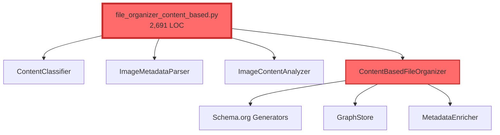
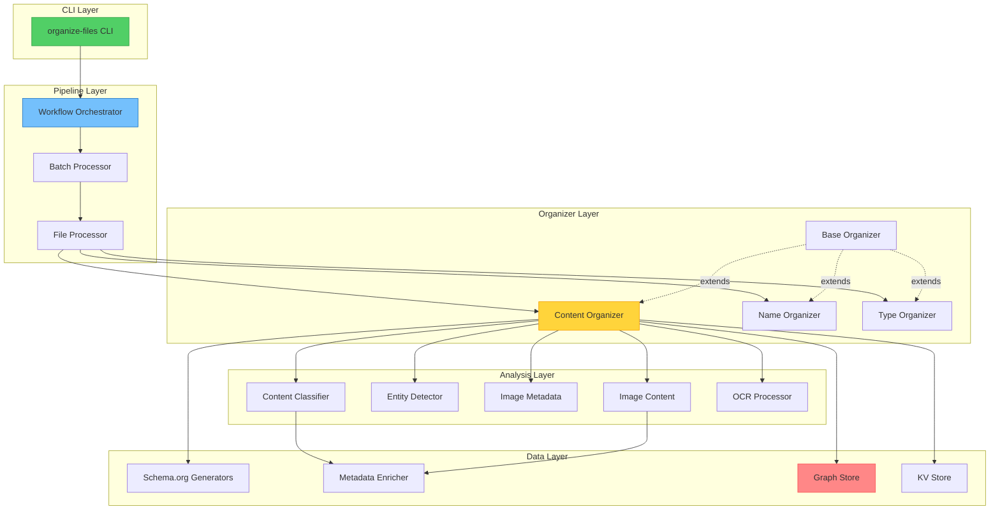
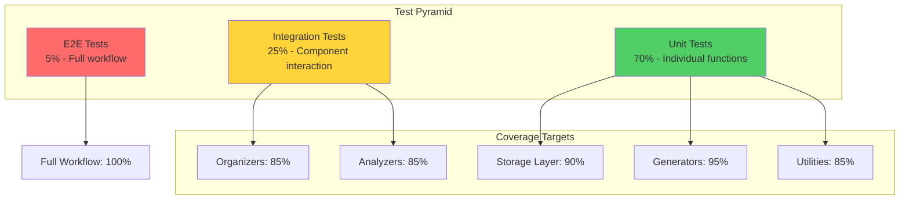

# Architecture Refactoring Plan

Visual overview of the current architecture vs. proposed refactored architecture.

## Current Architecture (Before Refactoring)

```
schema-org-file-system/
│
├── scripts/                              # 📜 Scripts (10,594 LOC)
│   ├── file_organizer_content_based.py   # 🔴 2,691 LOC - GOD SCRIPT
│   │   ├── ContentClassifier             #    375 LOC
│   │   ├── ImageMetadataParser           #    230 LOC
│   │   ├── ImageContentAnalyzer          #    186 LOC
│   │   ├── ContentBasedFileOrganizer     #  1,577 LOC
│   │   └── main()                        #    323 LOC
│   │
│   ├── file_organizer.py                 # 🟡 958 LOC - LARGE SCRIPT
│   │   ├── FileOrganizer                 #    869 LOC
│   │   └── main()                        #     89 LOC
│   │
│   ├── file_organizer_by_name.py         # 🟡 806 LOC
│   ├── data_preprocessing.py             # 🟡 651 LOC
│   ├── correction_feedback.py            # 🟡 620 LOC
│   └── ... (19 more scripts)
│
└── src/                                  # 🧩 Source Modules (10,120 LOC)
    ├── generators.py                     # 1,714 LOC - Schema.org generators
    ├── storage/
    │   ├── graph_store.py                # 1,146 LOC - Database operations
    │   ├── models.py                     #   864 LOC - ORM models
    │   ├── migration.py                  #   842 LOC - DB migrations
    │   └── kv_store.py                   #   758 LOC - Key-value store
    ├── cost_roi_calculator.py            #   824 LOC - Cost tracking
    ├── enrichment.py                     #   666 LOC - Metadata enrichment
    ├── base.py                           #   540 LOC - Base classes
    ├── validator.py                      #   488 LOC - Schema validation
    ├── error_tracking.py                 #   392 LOC - Sentry integration
    ├── health_check.py                   #   375 LOC - Dependency checks
    └── ... (7 more modules)
```

**Problems:**
- 🔴 **Monolithic scripts** - 2,691 LOC in single file
- 🔴 **Mixed concerns** - Classification + Analysis + Organization in one class
- 🔴 **Hard dependencies** - Difficult to test in isolation
- 🔴 **Code duplication** - Similar logic across multiple scripts
- 🔴 **Poor reusability** - Logic trapped in scripts, not importable

---

## Proposed Architecture (After Refactoring)

```
schema-org-file-system/
│
├── scripts/                              # 🎯 Thin CLI Wrappers (< 100 LOC each)
│   ├── file_organizer_content_based.py   # ✅ ~80 LOC - delegates to src
│   ├── file_organizer.py                 # ✅ ~60 LOC - delegates to src
│   └── ... (legacy wrappers, deprecated)
│
├── src/                                  # 🧩 Modular Components
│   │
│   ├── classifiers/                      # 📊 Content Classification
│   │   ├── __init__.py
│   │   ├── content_classifier.py         # ✅ ~300 LOC - keyword patterns
│   │   ├── entity_detector.py            # ✅ ~200 LOC - company/people detection
│   │   ├── category_rules.py             # ✅ ~150 LOC - classification rules
│   │   └── mime_classifier.py            # ✅ ~180 LOC - MIME type logic
│   │
│   ├── analyzers/                        # 🔍 Content Analysis
│   │   ├── __init__.py
│   │   ├── image_metadata.py             # ✅ ~250 LOC - EXIF/GPS extraction
│   │   ├── image_content.py              # ✅ ~200 LOC - CLIP vision
│   │   ├── ocr_processor.py              # ✅ ~280 LOC - OCR extraction
│   │   └── vision_classifier.py          # ✅ ~150 LOC - CLIP model wrapper
│   │
│   ├── organizers/                       # 📁 File Organization
│   │   ├── __init__.py
│   │   ├── base_organizer.py             # ✅ ~300 LOC - abstract base
│   │   ├── content_organizer.py          # ✅ ~450 LOC - AI-powered (refactored)
│   │   ├── name_organizer.py             # ✅ ~400 LOC - name-based (moved)
│   │   ├── type_organizer.py             # ✅ ~250 LOC - extension-based
│   │   ├── category_config.py            # ✅ ~180 LOC - folder structure
│   │   └── folder_strategy.py            # ✅ ~200 LOC - folder strategies
│   │
│   ├── pipeline/                         # 🔄 Workflow Orchestration
│   │   ├── __init__.py
│   │   ├── file_processor.py             # ✅ ~280 LOC - single file processing
│   │   ├── batch_processor.py            # ✅ ~350 LOC - batch operations
│   │   └── workflow.py                   # ✅ ~250 LOC - orchestration logic
│   │
│   ├── ml/                               # 🤖 Machine Learning
│   │   ├── __init__.py
│   │   ├── data_preprocessor.py          # ✅ ~300 LOC - ML data prep
│   │   ├── feature_extractor.py          # ✅ ~220 LOC - feature engineering
│   │   └── training_pipeline.py          # ✅ ~280 LOC - model training
│   │
│   ├── feedback/                         # 💬 User Feedback
│   │   ├── __init__.py
│   │   ├── correction_tracker.py         # ✅ ~250 LOC - user corrections
│   │   ├── feedback_loop.py              # ✅ ~200 LOC - feedback integration
│   │   └── label_manager.py              # ✅ ~180 LOC - label management
│   │
│   ├── storage/                          # 💾 Data Persistence (existing)
│   │   ├── graph_store.py                # ✅ 1,146 LOC
│   │   ├── models.py                     # ✅ 864 LOC
│   │   ├── migration.py                  # ✅ 842 LOC
│   │   └── kv_store.py                   # ✅ 758 LOC
│   │
│   ├── generators.py                     # ✅ 1,714 LOC - Schema.org (existing)
│   ├── enrichment.py                     # ✅ 666 LOC - enrichment (existing)
│   ├── base.py                           # ✅ 540 LOC - base classes
│   ├── validator.py                      # ✅ 488 LOC - validation
│   ├── cli.py                            # ✅ 282 LOC - unified CLI
│   └── ... (other existing modules)
│
└── tests/                                # ✅ Comprehensive Test Suite
    ├── conftest.py                       # Shared fixtures
    ├── fixtures/                         # Test data
    │   ├── images/
    │   ├── documents/
    │   └── sample_metadata.json
    │
    ├── unit/                             # Unit tests (isolated)
    │   ├── test_classifiers.py
    │   ├── test_analyzers.py
    │   ├── test_organizers.py
    │   ├── test_generators.py
    │   ├── test_enrichment.py
    │   └── ...
    │
    ├── integration/                      # Integration tests
    │   ├── test_storage_graph.py
    │   ├── test_storage_models.py
    │   ├── test_pipeline.py
    │   └── ...
    │
    └── e2e/                              # End-to-end tests
        ├── test_content_organizer.py
        └── test_full_workflow.py
```

**Benefits:**
- ✅ **Modular design** - Each module < 500 LOC
- ✅ **Single responsibility** - Clear separation of concerns
- ✅ **Testable** - Easy to test in isolation with mocks
- ✅ **Reusable** - Components can be imported and composed
- ✅ **Maintainable** - Easier to understand and modify
- ✅ **Extensible** - Easy to add new strategies/analyzers

---

## Component Interaction Diagram

### Current Flow (Monolithic)



**Problem:** Everything in one file, hard to test, hard to modify

---

### Proposed Flow (Modular)



**Benefits:** Clear layers, testable components, dependency injection

---

## Refactoring Strategy: file_organizer_content_based.py

### Before: Monolithic Class (1,577 LOC)

```python
class ContentBasedFileOrganizer:
    """
    God class doing everything:
    - Classification
    - OCR extraction
    - Vision analysis
    - Metadata parsing
    - Organization logic
    - Database persistence
    - Cost tracking
    - Error handling
    """

    def __init__(self, ...):
        # Hard-coded dependencies
        self.classifier = ContentClassifier()
        self.image_analyzer = ImageContentAnalyzer()
        self.metadata_parser = ImageMetadataParser()
        # ... 10+ more dependencies

    def organize_file(self, file_path: Path) -> Dict:
        # 400+ lines of complex logic
        # - OCR extraction
        # - Content classification
        # - Vision analysis
        # - Metadata parsing
        # - Folder determination
        # - Schema.org generation
        # - Database persistence
        # - Cost tracking
        pass
```

### After: Modular Components

```python
# src/organizers/content_organizer.py (~450 LOC)
class ContentBasedFileOrganizer(BaseOrganizer):
    """
    Coordinates content-based organization.
    Delegates to specialized components.
    """

    def __init__(
        self,
        classifier: Optional[ContentClassifier] = None,
        image_analyzer: Optional[ImageContentAnalyzer] = None,
        metadata_parser: Optional[ImageMetadataParser] = None,
        processor: Optional[FileProcessor] = None,
        **kwargs
    ):
        super().__init__(**kwargs)
        # Dependency injection for testability
        self.classifier = classifier or ContentClassifier()
        self.image_analyzer = image_analyzer or ImageContentAnalyzer()
        self.metadata_parser = metadata_parser or ImageMetadataParser()
        self.processor = processor or FileProcessor()

    def organize_file(self, file_path: Path) -> Dict:
        """Organize single file - delegates to processor."""
        return self.processor.process(
            file_path,
            classifier=self.classifier,
            analyzer=self.image_analyzer,
            metadata_parser=self.metadata_parser
        )


# src/pipeline/file_processor.py (~280 LOC)
class FileProcessor:
    """
    Processes individual files through the analysis pipeline.
    """

    def process(
        self,
        file_path: Path,
        classifier: ContentClassifier,
        analyzer: ImageContentAnalyzer,
        metadata_parser: ImageMetadataParser
    ) -> Dict:
        """
        Process file through pipeline:
        1. Extract content (OCR/metadata)
        2. Classify content
        3. Analyze content
        4. Generate metadata
        5. Persist to database
        """
        # ~150 lines - focused on orchestration
        content = self._extract_content(file_path)
        category = classifier.classify(content)
        analysis = analyzer.analyze(file_path)
        metadata = self._generate_metadata(file_path, category, analysis)
        return metadata


# src/classifiers/content_classifier.py (~300 LOC)
class ContentClassifier:
    """
    Classifies content into categories.
    Extracted from god class - focused single responsibility.
    """

    def classify(self, content: str) -> Tuple[str, str, Optional[str], List[str]]:
        """Classify content into category/subcategory."""
        # ~200 lines - focused on classification logic
        category = self._detect_category(content)
        company = self._detect_company(content)
        people = self._detect_people(content)
        return (category, subcategory, company, people)

    def _detect_category(self, content: str) -> str:
        """Detect category from content."""
        # ~50 lines - pattern matching

    def _detect_company(self, content: str) -> Optional[str]:
        """Detect company names."""
        # ~30 lines - entity detection

    def _detect_people(self, content: str) -> List[str]:
        """Detect people names."""
        # ~30 lines - entity detection
```

**Key Improvements:**
1. **Single Responsibility:** Each class has one job
2. **Dependency Injection:** Easy to test with mocks
3. **Smaller Methods:** < 50 lines each
4. **Clear Interfaces:** Well-defined inputs/outputs
5. **Composable:** Components can be mixed/matched

---

## Testing Strategy Visualization



---

## Migration Timeline

### Phase 1: Foundation (Weeks 1-2)
```
✅ Setup test infrastructure
✅ Write storage layer tests (90% coverage)
✅ Write generator tests (95% coverage)
✅ Write utility tests (85% coverage)
```

### Phase 2: Extract Classifiers (Week 3)
```
✅ Create src/classifiers/ module
✅ Extract ContentClassifier → content_classifier.py
✅ Extract entity detection → entity_detector.py
✅ Write unit tests for classifiers
```

### Phase 3: Extract Analyzers (Week 4)
```
✅ Create src/analyzers/ module
✅ Extract ImageMetadataParser → image_metadata.py
✅ Extract ImageContentAnalyzer → image_content.py
✅ Extract OCR logic → ocr_processor.py
✅ Write unit tests for analyzers
```

### Phase 4: Extract Organizers (Weeks 5-6)
```
✅ Create src/organizers/ module
✅ Create base_organizer.py (abstract base)
✅ Refactor ContentBasedFileOrganizer → content_organizer.py
✅ Move FileOrganizerByName → name_organizer.py
✅ Write integration tests
```

### Phase 5: Extract Pipeline (Week 7)
```
✅ Create src/pipeline/ module
✅ Extract FileProcessor
✅ Extract BatchProcessor
✅ Extract Workflow orchestration
✅ Write E2E tests
```

### Phase 6: Polish (Week 8)
```
✅ Update CLI to use new modules
✅ Deprecate old scripts
✅ Update documentation
✅ Final test coverage push (85%+)
```

---

## Success Metrics

| Metric | Before | After | Improvement |
|--------|--------|-------|-------------|
| **Largest File** | 2,691 LOC | < 500 LOC | 81% reduction |
| **Test Coverage** | ~5% | 85%+ | 17x increase |
| **Modules in src/** | 17 | 35+ | 2x increase |
| **Testable Components** | ~10 | 35+ | 3.5x increase |
| **Avg LOC/File** | 590 | < 300 | 49% reduction |
| **Code Duplication** | High | < 5% | Eliminated |

---

## References

- **Full Plan:** `docs/TEST_AND_REFACTOR_PLAN.md`
- **Quick Start:** `docs/QUICK_START_TESTING.md`
- **Current CLAUDE.md:** Root directory

**Last Updated:** 2025-12-10
