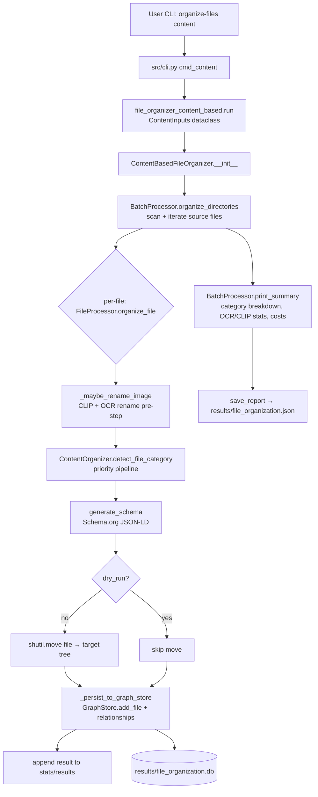

# File Organization — Pipeline & Renamer Modes

Two entry points share the CLIP + OCR classification machinery:

- **`organize-files content`** — the full content pipeline: classify → generate
  Schema.org JSON-LD → move → persist to the graph store → report.
- **`scripts/rename_images.py`** — a standalone CLIP renamer used both on its
  own and as the pipeline's rename pre-step (`ImageAnalyzer`).

> **Architecture note.** `scripts/file_organizer_content_based.py` is a thin CLI
> wrapper. `ContentBasedFileOrganizer` subclasses
> `src.organizers.content_organizer.ContentOrganizer` (classification) and
> composes `src.pipeline.FileProcessor` (per-file schema + move + persist) and
> `src.pipeline.BatchProcessor` (directory scan + batch loop). The subclass
> methods (`organize_file`, `_persist_to_graph_store`, `print_summary`,
> `save_report`, …) are one-line delegators to those pipeline objects.

---

## Part 1 — `organize-files content` data flow

End-to-end trace from argument parsing through classification, file move,
persistence, and reporting.

### High-level flow



### 1. CLI entry & argument forwarding
- `src/cli.py:cmd_content` — adds `scripts/` to `sys.path`, imports
  `run` from `file_organizer_content_based`, and calls
  `run(ContentInputs.from_namespace(args))`. No `sys.argv` rewriting; args
  travel as the frozen `src.cli_inputs.ContentInputs` dataclass.
- `ContentInputs` fields: `sources`, `base_path`, `dry_run`, `limit`,
  `report`, `force`, `no_cost_tracking`, `cost_report`, `check_deps`,
  `skip_health_check`, `sentry_dsn`, `no_sentry`, `db_path`, `no_db`,
  `run_migration`. The option definitions live in
  `src.cli.add_content_arguments` (single source, shared with the standalone
  `main()`).

### 2. Entry point (`file_organizer_content_based.run`)
- `run(args: ContentInputs)`: initializes Sentry (unless `--no-sentry`),
  runs the health check (unless `--skip-health-check`), optionally runs the
  ID migration (`--run-migration`) and returns, then constructs
  `ContentBasedFileOrganizer(base_path, enable_cost_tracking, db_path)` and
  calls `organize_directories(sources, dry_run, limit, force)`.
- After the batch: `print_summary`, then `save_report` (when `--report` or
  not a dry run), then `save_cost_report` (when cost tracking is on), then a
  `_site` refresh via `copy_to_site.sh` (skipped on dry run).
- `main()` is the standalone (`python scripts/…`) entry: builds the same
  `argparse` parser via `add_content_arguments` and calls `run`.

### 3. Organizer initialization (`ContentBasedFileOrganizer.__init__`)
- `GraphStore(db_path)` — SQLite persistence (skipped if `--no-db`)
- `CostROICalculator` (optional, when cost tracking enabled)
- `MetadataEnricher`, `SchemaValidator`, `SchemaRegistry`
- `ContentClassifier` — keyword/Schema.org taxonomy classifier
- `ImageAnalyzer(PHOTO_PROFILE)` — CLIP + OCR rename analyzer, stored as
  `self.rename_analyzer` (imported from `rename_images`; the former
  `ImageContentRenamer` shim was removed). See [Part 2](#part-2--rename_imagespy-profiles--modes).
- `ImageContentAnalyzer` — CLIP zero-shot + face detection
- `ImageMetadataParser`, `TextExtractor`
- `super().__init__(...)` hands the classification dependencies to
  `ContentOrganizer`; the pipeline is then composed:
  `FileProcessor(..., organizer=self)` and
  `BatchProcessor(file_processor=…)`. Both call back into the organizer for
  classification (`detect_file_category`, `should_skip_file`,
  `get_destination_path`) and share the `stats` counter.

### 4. Per-file pipeline (`FileProcessor.organize_file`, `src/pipeline/file_processor.py`)

#### 4a. Rename pre-step
`FileProcessor._maybe_rename_image`:
- Skips non-generic filenames (`shared.filename_utils.is_generic_filename`)
- Skips non-image extensions
- Calls `self.rename_analyzer.analyze_image(path)` →
  `shared.clip_classification.classify_with_ocr_fallback` (CLIP first;
  OCR fallback below `CLIP_OCR_FALLBACK_THRESHOLD`; refinement above
  `CLIP_REFINEMENT_MIN_CONFIDENCE`)
- If renaming, calls `resolve_collision` then `Path.rename`.

#### 4b. Classification priority (`ContentOrganizer.detect_file_category`, `src/organizers/content_organizer.py`)

Actual tier order (the `PRIORITY n` comment labels in source are
non-contiguous — this is the runtime sequence):

1. **Renamed screenshots** — when the renamer produced a descriptive stem
   for a `screenshot` file, its label is matched against the
   `category_paths["media"]["photos"]["screenshots"]` sub-taxonomy keys →
   `media/photos_screenshots_*`
2. **Filename patterns** (`classify_by_filename_patterns`) — invoices,
   resumes, technical/legal/business docs, entity files
3. **Organization / Person detection** (document types only) —
   `classify_by_organization`, then `classify_by_person`
4. **Game assets** (`classify_game_asset`)
5. **Filepath patterns** (`classify_by_filepath`)
6. **Identification documents** (`_classify_identification_document`) —
   `shared.ocr_classifier.extract_ocr_with_confidence` + optional KIE
   (`extract_kie_fields` when OCR confidence ≥ `_OCR_CONFIDENCE_THRESHOLD`)
7. **Media classification** (`classify_media_file`); weak image results
   pass through `enhance_weak_image_classification` (CLIP refinement)
8. **Screenshot sub-classification** — `shared.ocr_classifier.classify_by_ocr`
   (4-tuple: category, confidence, scores, text) + CLIP refinement
9. **Photos with people / home interior** —
   `ImageContentAnalyzer.has_people_in_photo`,
   `is_home_interior_no_people` (CLIP + face detection)
10. **Text extraction + content classification**
    (`_classify_by_content_and_kie` → `ContentClassifier.classify_content`,
    Schema.org taxonomy; KIE result wins when present)

#### 4c. Schema + move + persist
- `generate_schema` — builds JSON-LD (ImageObject, DigitalDocument, etc.)
  via `generators.py`
- `shutil.move(src, dst)` — moves file unless `dry_run`
- `FileProcessor._persist_to_graph_store` — writes file + category,
  company, person, location relationships.

### 5. Persistence (`GraphStore`, `src/storage/graph_store.py`)
- `add_file(original_path, filename, **kwargs)`:
  - `id` = SHA256 of original path
  - `canonical_id` = `urn:sha256:{hash}`
  - Stores: `current_path`, `original_path`, `file_size`, `mime_type`,
    `schema_data` (JSON-LD), `extracted_text`,
    `extracted_text_length`, `ocr_confidence`, `detected_language`,
    `kie_fields`, `session_id`; status `FileStatus.ORGANIZED`
- Relationships added by the pipeline:
  - `add_file_to_category`
  - `add_file_to_company` (if Organization detected)
  - `add_file_to_person` (per person detected)
  - `add_file_to_location` (when geo metadata present)
- Session grouping: `BatchProcessor.organize_directories` opens an
  `organization_sessions` row (`create_session`) before the file loop and
  completes it (`complete_session`) after — on real (non-dry-run) runs with a
  graph store; each persisted file links back via `files.session_id`. This is
  what the timeline (`organize-files timeline`) groups by; see
  [`docs/TIMELINE.md`](TIMELINE.md).
- Backing store: `results/file_organization.db` (SQLite via SQLAlchemy).

**Graph persistence is `organize-files content` only — by design.** Only the
content pipeline writes to the graph store. `organize-files type`
(`scripts/file_organizer_by_type.py`) and `organize-files name`
(`src/organizers/name_organizer.py`) are the deliberately no-AI, DB-free
organizers: they move files and write their own JSON report but touch no
`GraphStore` — no `add_file`, no `create_session`/`_persist_to_graph_store`, no
`--db-path`. Their runs therefore never appear in the graph or on the timeline;
this is expected behavior, not a bug. The only `GraphStore.add_file` callers are
the content `FileProcessor` and `person_migration`.

### 6. Output & reporting

`BatchProcessor.print_summary` emits:
- Totals: processed, organized, already organized, skipped, errors
- Category breakdown (top-level category from `detect_file_category`)
- Content extraction stats — files with extracted text
- Detected companies — counts per company
- Cost breakdown — per-feature costs (CLIP, OCR, face detection, KIE)
  when cost tracking is enabled

`FileProcessor.save_report` writes the full per-file `results` list to
`results/file_organization.json` (override with `--report`).

### Outputs

| Sink | Path | Written by |
|---|---|---|
| File moves | `~/Documents/{Category}/…` (configurable via `--base-path`) | `shutil.move` in `FileProcessor.organize_file` |
| Graph DB | `results/file_organization.db` | `GraphStore.add_file` + relationship helpers |
| JSON report | `results/file_organization.json` | `FileProcessor.save_report` |
| Cost report | `--cost-report` path (when tracking enabled) | `FileProcessor.save_cost_report` |
| Console summary | stdout | `BatchProcessor.print_summary` |
| Sentry events (optional) | configured DSN | `src/error_tracking.py` |

---

## Part 2 — `rename_images.py` profiles & modes

`scripts/rename_images.py` is the unified CLIP-based renamer. It selects a
vocabulary via `--profile` and an organization style via `--mode`. The content
pipeline reuses it via `ImageAnalyzer(PHOTO_PROFILE)` (see §3).

### Profiles

| Profile | Vocabulary | Default mode |
|---------|-----------|--------------|
| `photo` | General photo content (sofa, dog, food, landscape...) | `in-place` |
| `screenshot` | Game-asset + software-UI categories with folder routing | `folder` |

Defaults are set on each `RenamerProfile` (`PHOTO_PROFILE.default_mode = "in-place"`,
`SCREENSHOT_PROFILE.default_mode = "folder"`).

### Modes

**`in-place`** — renames files in their original location without moving them.
- **Use case**: filename cleanup with no directory changes
- **Behavior**: `IMG_1234.jpg` → `landscape-sunset-2025-04-19.jpg` (same directory)
- **Implementation**: `FileOrganizer._rename_in_place` → `Path.rename()`

**`folder`** — moves and renames files into subdirectories by detected category.
- **Use case**: organize files into a category-based folder structure
- **Behavior**: `Screenshot.png` → `Software/Dashboards/dashboard-2025-04-19.png`
- **Implementation**: `FileOrganizer` → `shutil.copy2()` into the resolved
  category subdirectory

### Configuration

```bash
# Photo profile (default mode: in-place)
python scripts/rename_images.py ~/Downloads --profile photo --execute

# Screenshot profile (default mode: folder)
python scripts/rename_images.py ~/Documents/Screenshots --profile screenshot --execute

# Override mode explicitly
python scripts/rename_images.py ~/Downloads --profile photo --mode folder --execute

# Or via environment variable
export FILE_ORGANIZE_MODE=folder
python scripts/rename_images.py ~/Downloads --profile photo
```

Priority: `--mode` > `FILE_ORGANIZE_MODE` > profile default
(`rename_images.py`: `mode = args.mode or os.environ.get("FILE_ORGANIZE_MODE") or profile.default_mode`).

### Implementation

`rename_images.py` defines a `RenamerProfile` dataclass holding categories,
folder mapping, refinement terms, and short names. `ImageAnalyzer` reads the
profile and runs the shared `classify_with_ocr_fallback` pipeline; results are
handed to `FileOrganizer` for the in-place rename or folder move. To add a new
flavor, define a `RenamerProfile` and register it in `PROFILES`.

Screenshot naming prefers a title-like OCR line
(`title_snippet_from_lines` in `scripts/shared/filename_utils.py`) →
`Screenshot_<title>.<ext>`, falling back to the CLIP label when no line
qualifies.

---

## Shared CLIP / OCR integration points

| Concern | Module | Key function | Return |
|---|---|---|---|
| Image OCR text | `shared/ocr_classifier.py` | `extract_ocr_with_confidence` | `OCRResult(text, confidence, language)` |
| PDF OCR text | `shared/ocr_classifier.py` | `extract_ocr_text_pdf` | `str` |
| OCR-driven classification | `shared/ocr_classifier.py` | `classify_by_ocr` | `(category, confidence, scores, text)` — 4-tuple |
| CLIP + OCR fallback | `shared/clip_classification.py` | `classify_with_ocr_fallback` | `CLIPResult(category, confidence, all_scores)` |
| Image rename analysis | `scripts/rename_images.py` | `ImageAnalyzer.analyze_image` (profile-driven) | `dict(new_name, category, confidence, status)` |
| Content (text) classifier | `src/classifiers/content_classifier.py` | `ContentClassifier.classify_content` | `(category, subcategory, company, people)` |

CLIP confidence thresholds are defined in `scripts/shared/constants.py`
(imported by both `clip_classification.py` and `rename_images.py`):
- `CLIP_OCR_FALLBACK_THRESHOLD = 0.10` — below this, run OCR fallback
- `CLIP_REFINEMENT_MIN_CONFIDENCE = 0.15` — minimum to attempt refinement
- `CLIP_REFINEMENT_ACCEPT_CONFIDENCE = 0.30` — minimum to accept refined term
