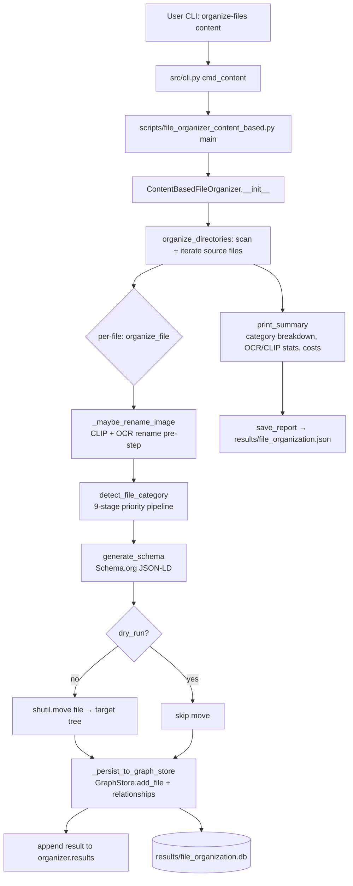

# `organize-files content` — Data Flow

End-to-end trace of the `organize-files content` CLI command, from
argument parsing through classification, file move, persistence, and
reporting.

## High-level flow

## Stage detail

### 1. CLI entry & argument forwarding
- `src/cli.py:cmd_content` — adds `scripts/` to `sys.path`, imports
  `ContentBasedFileOrganizer` and `main`, rewrites `sys.argv`, and
  delegates.
- Forwarded args: `--sources`, `--target` / `--base-path`, `--dry-run`,
  `--limit`, `--report`, `--db-path`, `--no-cost-tracking`,
  `--no-sentry`, `--no-db`.

### 2. Main setup
- `scripts/file_organizer_content_based.py:main()` (~line 4277):
  parses argv, constructs `ContentBasedFileOrganizer(base_path,
  enable_cost_tracking, db_path)`, then calls
  `organize_directories(source_dirs, dry_run, limit, force)`.

### 3. Organizer initialization (`ContentBasedFileOrganizer.__init__`,
~line 1234)
- `GraphStore(db_path)` — SQLite persistence (skipped if `--no-db`)
- `MetadataEnricher`, `SchemaValidator`
- `ContentClassifier` — keyword/Schema.org taxonomy classifier
- `ImageContentRenamer` — wraps `ImageAnalyzer` (CLIP + OCR rename)
- `ImageContentAnalyzer` — CLIP zero-shot + OpenCV face detection
- Cost tracker (optional), Sentry init (optional)

### 4. Per-file pipeline (`organize_file`, ~line 3918)

#### 4a. Rename pre-step
`_maybe_rename_image` (~line 3884):
- Skips non-generic filenames (`shared.filename_utils.is_generic_filename`)
- Skips non-image extensions (`ImageContentRenamer.IMAGE_EXTENSIONS`)
- Calls `self.image_renamer.analyzer.analyze_image(path)` →
  `shared.clip_classification.classify_with_ocr_fallback` (CLIP first;
  OCR fallback below 0.10 confidence; refinement above 0.15)
- If renaming, calls `resolve_collision` then `Path.rename`.

#### 4b. Classification priority (`detect_file_category`, ~line 3236)
1. Filename patterns (`classify_by_filename_patterns`)
2. Organization detection (`classify_by_organization`)
3. Person detection (`classify_by_person`)
4. Game assets (`classify_game_asset`)
5. Filepath patterns (`classify_by_filepath`)
6. Identification documents — OCR with confidence
   (`shared.ocr_utils.extract_ocr_with_confidence`) + optional KIE
7. Media classification (`classify_media_file`)
8. Screenshot sub-classification — `shared.ocr_classifier.classify_by_ocr`
   (4-tuple: category, confidence, scores, text), then
   `enhance_weak_image_classification` (CLIP refinement)
9. Image content analysis — `ImageContentAnalyzer.has_people_in_photo`
   and `is_home_interior_no_people` (CLIP + face detection)
10. Text extraction + `ContentClassifier.classify_content`
    (Schema.org taxonomy); KIE result wins when present.

#### 4c. Schema + move + persist
- `generate_schema` — builds JSON-LD (ImageObject, DigitalDocument,
  etc.) from generators.py
- `shutil.move(src, dst)` — moves file unless `dry_run`
- `_persist_to_graph_store` (~line 3806): writes file + category,
  company, person, location relationships.

### 5. OCR / CLIP integration points

| Concern | Module | Key function | Return |
|---|---|---|---|
| Image OCR text | `shared/ocr_utils.py` | `extract_ocr_with_confidence` | `OCRResult(text, confidence, language)` |
| PDF OCR text | `shared/ocr_utils.py` | `extract_ocr_text_pdf` | `str` |
| OCR-driven classification | `shared/ocr_classifier.py:86` | `classify_by_ocr` | `(category, confidence, scores, text)` — 4-tuple |
| CLIP + OCR fallback | `shared/clip_classification.py:71` | `classify_with_ocr_fallback` | `CLIPResult(category, confidence, all_scores)` |
| Image rename analysis | `scripts/image_content_renamer.py:84` | `ImageAnalyzer.analyze_image` | `dict(new_name, category, confidence, status)` |
| Content (text) classifier | `src/classifiers/content_classifier.py` | `ContentClassifier.classify_content` | `(category, subcategory, company, people)` |

CLIP confidence thresholds in `ImageAnalyzer`:
- `_CLIP_OCR_FALLBACK_THRESHOLD = 0.10` — below this, run OCR fallback
- `_CLIP_REFINEMENT_MIN_CONFIDENCE = 0.15` — minimum to attempt refinement
- `_CLIP_REFINEMENT_ACCEPT_CONFIDENCE = 0.30` — minimum to accept refined term

### 6. Persistence (`GraphStore`, `src/storage/graph_store.py`)
- `add_file(original_path, filename, **kwargs)` (~line 85):
  - `id` = SHA256 of original path
  - `canonical_id` = `urn:sha256:{hash}`
  - Stores: `current_path`, `original_path`, `file_size`, `mime_type`,
    `schema_data` (JSON-LD), `extracted_text`,
    `extracted_text_length`, `ocr_confidence`, `detected_language`,
    `kie_fields`; status `FileStatus.ORGANIZED`
- Relationships added by organizer:
  - `add_file_to_category`
  - `add_file_to_company` (if Organization detected)
  - `add_file_to_person` (per person detected)
  - `add_file_to_location` (when geo metadata present)
- Backing store: `results/file_organization.db` (SQLite via SQLAlchemy).

### 7. Output & reporting

`print_summary` (~line 4170) emits:
- Totals: processed, organized, already organized, skipped, errors
- Category breakdown (top-level category from `detect_file_category`)
- Content extraction stats — files with extracted text
- Detected companies — counts per company
- Cost breakdown — per-feature costs (CLIP, OCR, face detection, KIE)
  when cost tracking is enabled

`save_report` (~line 4306) writes the full per-file `results` list to
`results/file_organization.json` (override with `--report`).

## Outputs

| Sink | Path | Written by |
|---|---|---|
| File moves | `~/Documents/{Category}/…` (configurable via `--base-path`) | `shutil.move` in `organize_file` |
| Graph DB | `results/file_organization.db` | `GraphStore.add_file` + relationship helpers |
| JSON report | `results/file_organization.json` | `save_report` |
| Console summary | stdout | `print_summary` |
| Sentry events (optional) | configured DSN | `src/error_tracking.py` |
